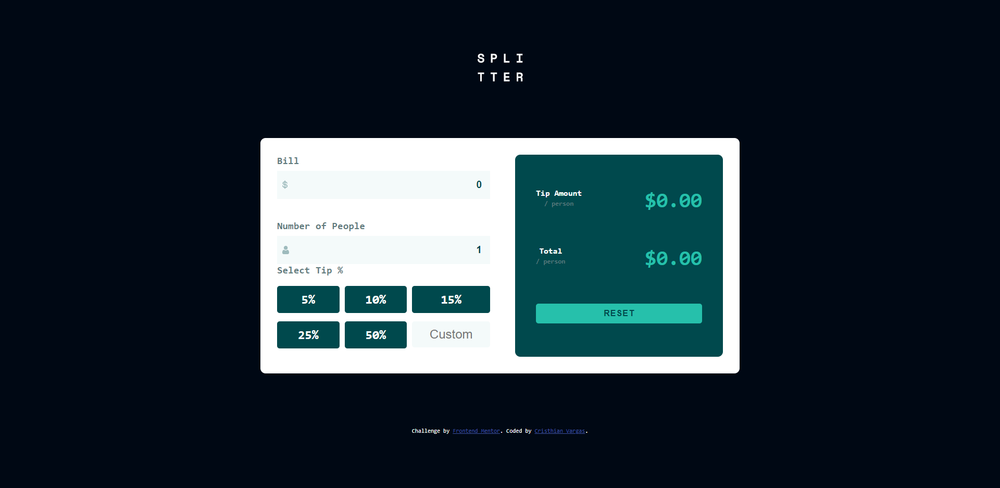

# Frontend Mentor - Tip calculator App Challenge

### Simple Tip calculator with some validations
- All the layout was build using mostly Flex box, for the custom tips button i use Grid.
- Next implementation is to build it for mobile devices

